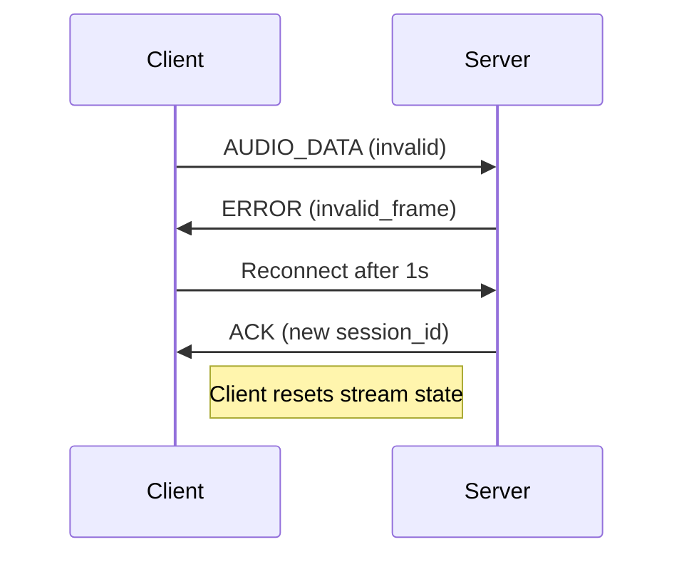

Here is the updated **WebSocket Audio Streaming Protocol Specification (v2.1)** reflecting the changes:

---

# WebSocket Audio Streaming Protocol Specification (v2.1)

## 1. Message Types

### Client → Server Messages

**Frame Size**: The `FRAME_SIZE` is 640 samples (40ms at 16kHz), which translates to 1280 bytes for 16-bit mono audio (`640 * 2`).

#### `START` Message (JSON)

```json
{
  "type": "start",
  "session_id": "uuid4",
  "sample_rate": 16000,
  "channels": 1,
  "frame_duration": 40
}
```

#### `AUDIO_DATA` Message (Binary)

```
[4-byte frame length][Opus frame data]
```

#### `STOP` Message (JSON)

```json
{
  "type": "stop",
  "session_id": "uuid4"
}
```

---

### Server → Client Messages

#### `ACK` Message (JSON)

```json
{
  "type": "ack",
  "session_id": "uuid4",
  "status": "session_started",
  "transcription_enabled": false
}
```

#### `AUDIO_RESPONSE` Message (JSON)

Sent before streaming generated audio

```json
{
  "type": "audio_response",
  "format": "opus",
  "sample_rate": 16000,
  "channels": 1,
  "frame_duration": 40,
  "frame_count": 458,
  "text": "default.mp3 audio stream"
}
```

#### `STOP` Message (JSON)

Sent after audio streaming completes

```json
{
  "type": "stop",
  "session_id": "uuid4"
}
```

#### `ERROR` Message (JSON)

```json
{
  "type": "error",
  "code": "invalid_frame",
  "message": "Expected 1280 bytes, got 1000"
}
```

---

## 2. Binary Data Format

* **Frame Header**: 4-byte big-endian integer (frame length)
* **Payload**: Raw Opus frame (40ms duration)
* **Maximum Frame Size**: 1275 bytes (Opus max compressed)

---

## 3. Client Behavior

* On receiving `"stop"` message:

  * Print `🛑 Received stop signal from server`
  * Stop playback
  * Set `streaming_active = False`

* On receiving `"audio_response"`:

  * Display metadata (format, duration, sample rate)
  * Initialize playback if not already started

---

## 4. Metadata Requirements

| Parameter      | Value  | Notes                            |
| -------------- | ------ | -------------------------------- |
| Sample Rate    | 16 kHz | Optimized for voice applications |
| Channels       | Mono   | Single-channel audio             |
| Frame Duration | 40 ms  | Increased for bandwidth savings  |

---

## 5. Error Handling

### Error Types

* `invalid_frame`: Frame header mismatch or decoding failure
* `network_error`: Auto-reconnect with exponential backoff
* `protocol_error`: Terminate connection gracefully
* `session_error`: Invalid or expired session

### Enhanced Error Recovery



---

## 6. File Saving

* **Format**: WAV (16-bit PCM)
* **Naming Convention**: `YYYYMMDD-HHMMSS-<session_id>.wav`
* **Storage Location**: Server-side only
* **Playback**: Automatically initiated post-session (optional)

---

## Implementation Details

1. **Server**: FastAPI + Uvicorn with WebSocket endpoint
2. **Client**: PyAudio + Opuslib, triggered via keyboard or UI
3. **Audio Format**: Opus-encoded PCM with 40ms frames
4. **Session ID**: UUID4 for unique tracking per stream
5. **MP3 Metadata Logging**: Printed server-side before stream
6. **Playback Strategy**: Real-time streaming and decoding

---

Let me know if you'd like this exported as a PDF or included in your README or API docs.
