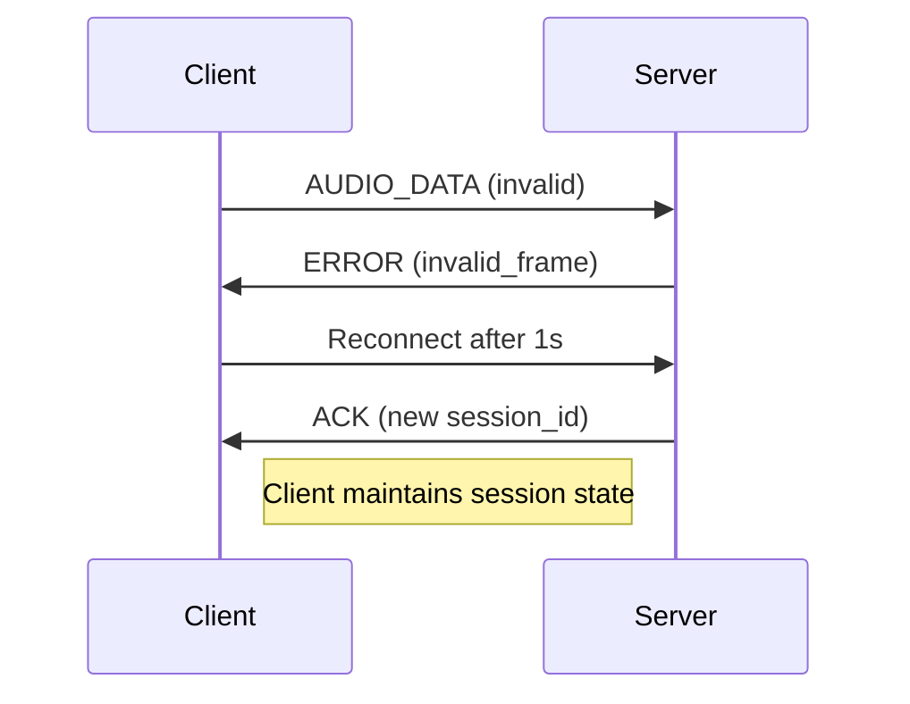

# WebSocket Audio Streaming Protocol Specification (v2.0)

## 1. Message Types

### Client → Server Messages

Frame Size: The FRAME_SIZE is 320 samples (20ms at 16kHz), which translates to 640 bytes for 16-bit mono audio (320 * 2). 

#### START Message (JSON)
```json
{
  "type": "start",
  "session_id": "uuid4",
  "sample_rate": 16000,
  "channels": 1,
  "frame_duration": 20
}
```

#### AUDIO_DATA Message (Binary)
```
[4-byte frame length][Opus frame data]
```

#### STOP Message (JSON)
```json
{"type": "stop", "session_id": "uuid4"}
```

### Server → Client Messages

#### ACK Message (JSON)
```json
{
  "type": "ack",
  "session_id": "uuid4",
  "status": "session_started",
  "transcription_enabled": true
}
```

#### AUDIO_RESPONSE Message (JSON)
Sent before streaming generated audio
```json
{
  "type": "audio_response",
  "format": "opus",
  "sample_rate": 16000,
  "channels": 1,
  "frame_duration": 20,
  "frame_count": 458,
  "text": "LLM response text here"
}
```

#### STOP Message (JSON)
Sent after audio streaming completes
```json
{"type": "stop", "session_id": "uuid4"}
```

#### ERROR Message (JSON)
```json
{
  "type": "error",
  "code": "invalid_frame",
  "message": "Expected 120 bytes, got 100"
}
```

## 2. Binary Data Format
- **Frame Header**: 4-byte big-endian integer (frame length)
- **Payload**: Raw Opus frame (20ms duration)
- Maximum frame size: 1275 bytes (Opus limit)

## 3. Client Behavior
- On receiving "stop" message:
  - Print "🛑 Received stop signal from server"
  - Set streaming_active = False
  - Stop sending audio data

## 4. Metadata Requirements
Parameter     | Value  | Notes                          |
|---------------|--------|--------------------------------|
Sample Rate   | 16 kHz | Optimized for voice applications |
Channels      | Mono   | Single channel audio           |
Frame Duration| 20 ms  | Balanced latency/quality       |

## 5. Error Handling

### Error Types:
- `invalid_frame`: Frame header mismatch or decoding failure
- `network_error`: Automatic reconnect with exponential backoff
- `protocol_error`: Terminate connection
- `session_error`: Invalid session operation

### Enhanced Error Recovery:


## 6. File Saving
- **Format**: WAV files (16-bit PCM)
- **Naming**: `YYYYMMDD-HHMMSS-<session_id>.wav`
- **Storage**: Server-side only
- **Playback**: Automatic playback after session ends

## Implementation Details
1. Server: FastAPI + Uvicorn with WebSocket endpoint
2. Client: PyAudio + Opuslib with keyboard controls
3. Audio Processing: Real-time encoding/decoding
4. Session Management: UUID-based session tracking
5. Stop Signal: Sent after audio streaming completes